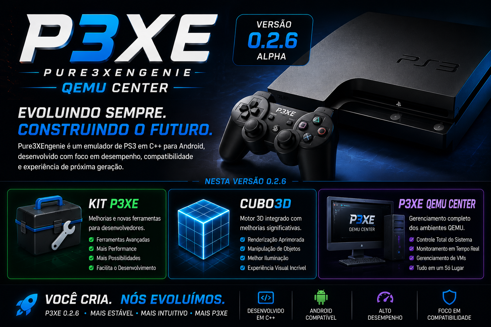

<p align="center">
  
</p>

<h1 align="center">Pure3XEngine</h1>

<p align="center">
PlayStation 3 Experimental Emulator • Android • Cubo3D • QEMU Center
</p>

---

# Pure3XEngine 0.2.6 Alpha

A Pure3XEngine é um projeto experimental de emulação de PlayStation 3 desenvolvido em C++20 para Android.

O projeto possui arquitetura modular, permitindo que cada componente evolua de forma independente, incluindo renderização gráfica, virtualização, ferramentas de desenvolvimento e integração com Android.

> Status atual: **Development / Alpha**

---

# Destaques da versão 0.2.6 Alpha

- Novo GitHub Center
- Banner Manager integrado
- Cubo3D Launcher
- QEMU Center
- Sistema automático de README
- Ferramentas de Build
- Estrutura modular reorganizada
- Compatível com Android
- Build utilizando CMake + Clang
- Código em C++20

---

# Componentes

| Componente | Estado |
|------------|---------|
| CoreEmulator | ✅ Disponível |
| Cubo3D | ✅ Disponível |
| QEMU Center | ✅ Disponível |
| Android | ✅ Disponível |
| Config | ✅ Disponível |
| Ferramentas P3XE | ✅ Disponível |

---

# Arquitetura

```
Pure3XEngine/

├── CoreEmulator/
├── Cubo3D/
├── QEMUCenter/
├── Android/
├── Config/
├── assets/
│   ├── banners/
│   └── images/
├── exports/
│   ├── apk/
│   └── releases/
├── tools/
│   ├── ai/
│   ├── common/
│   ├── emulator/
│   └── github/
└── README.md
```

---

# Cubo3D

Motor gráfico responsável pela renderização.

Recursos:

- OpenGL ES
- Vulkan
- Shader Manager
- Render Pipeline
- Texture Manager

---

# QEMU Center

Sistema responsável pela virtualização.

Inclui:

- Runtime QEMU
- Gerenciamento de Máquinas Virtuais
- Inicialização simplificada
- Integração com Android

---

# Android

Camada responsável pela integração com dispositivos Android.

Inclui:

- JNI
- Native Activity
- Surface Manager
- OpenGL ES
- Vulkan
- APK Runtime

---

# Development Kit

O P3XE Development Kit fornece ferramentas para:

- Build
- Diagnóstico
- Correção automática
- GitHub Center
- Banner Manager
- Release Manager
- README Generator

---

# Tecnologias

- C++20
- CMake
- Clang
- Shell Script
- OpenGL ES
- Vulkan
- Git
- GitHub
- Android NDK

---

# Build

```bash
cd ~/Pure3XEngine

bash tools/ai/menu.sh
```

ou utilize o **GitHub Center** para gerenciar o projeto.

---

# Estrutura Modular

Cada módulo funciona de forma independente.

- CoreEmulator
- Cubo3D
- Android
- QEMU Center
- GitHub Center
- Banner Manager
- Release Manager

---

# Roadmap

## 0.2.x Alpha

- Estrutura principal
- Ferramentas de desenvolvimento
- Cubo3D
- QEMU Center
- GitHub Center

## 0.3.x Beta

- Interface Android
- Melhorias no Renderer
- Inicialização de jogos
- Sistema de Configuração

## Futuro

- Emulação PlayStation 3
- RSX
- PPU
- SPU
- Áudio
- Entrada
- Compatibilidade crescente

---

# Licença

GNU General Public License 0.2.6 (GPL-3.0)

Consulte o arquivo **LICENSE** para mais informações.

---

<p align="center">


**Pure3XEngine 0.2.6 Alpha**

Desenvolvido para pesquisa, aprendizado e evolução da emulação de PlayStation 3 no Android.
</p>

## 📊 Estatísticas

- 📄 Arquivos C++: **73**
- 📄 Arquivos Header: **66**
- 📄 Scripts Shell: **190**
- 📄 CMake: **7**
- 📊 Linhas de código: **0**

